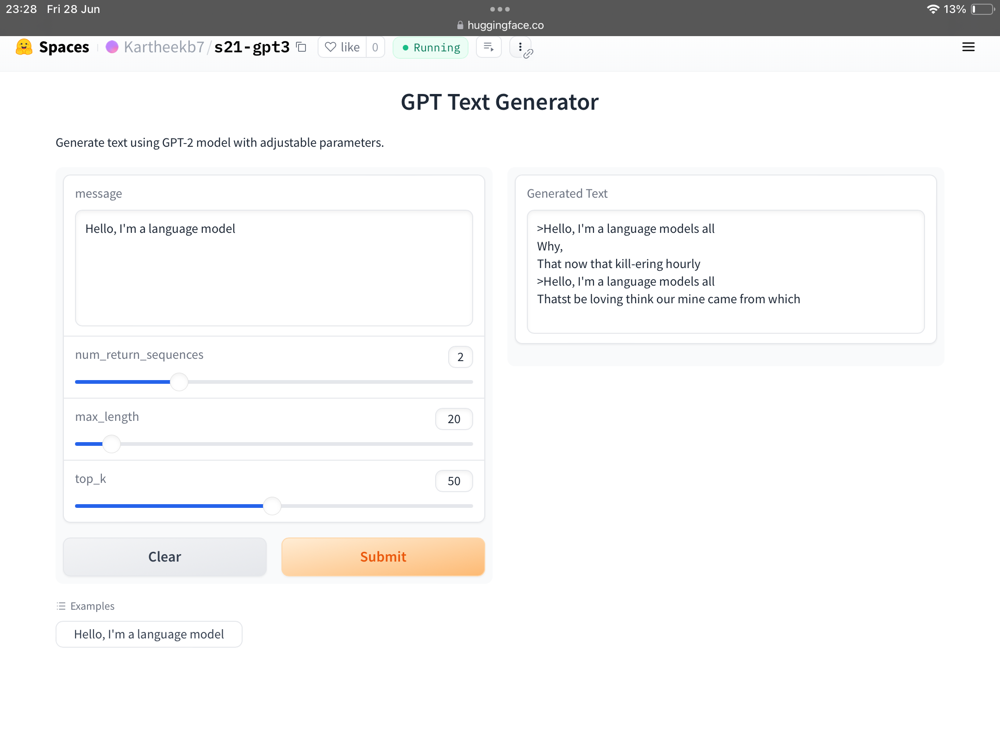

# GPT-2 Implementation

## Project Overview

This project implements GPT-2, a state-of-the-art language model developed by OpenAI. The model is trained from scratch on a Shakespeare dataset using the GPT-2 architecture.

## Hugging Face App

Explore our GPT-2 implementation on Hugging Face Spaces [here](https://huggingface.co/spaces/Kartheekb7/s21-gpt3).

## Notebook

View the implementation notebook `gpt2.ipynb`.

## Screenshot



## Features

- **Text Generation**: Demonstrates text generation capabilities of GPT-2 based on input prompts.

## Usage

To use the GPT-2 implementation:

1. **Clone Repository**:

   ```bash
   git clone https://github.com/11kartheek/gpt2dummy.git
   cd gpt2dummy

## Note
current loss is 0.2613 will update by tomorrow eod with loss than 0.09
